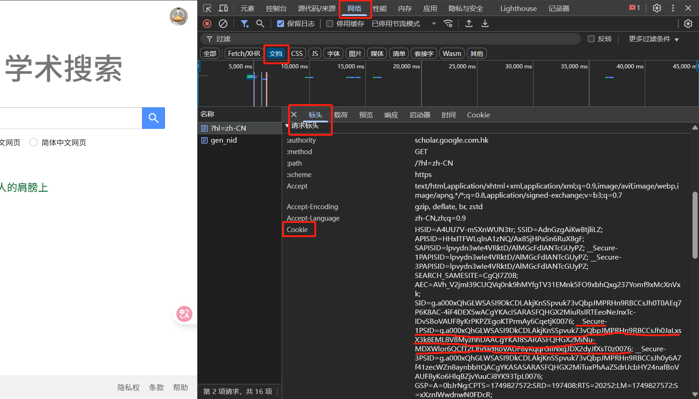
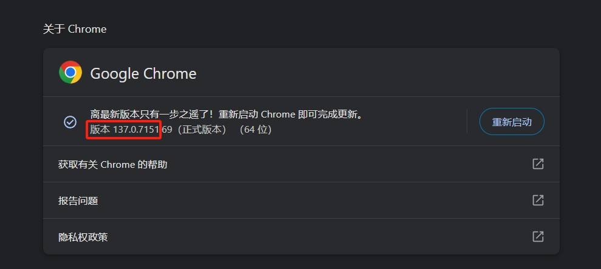
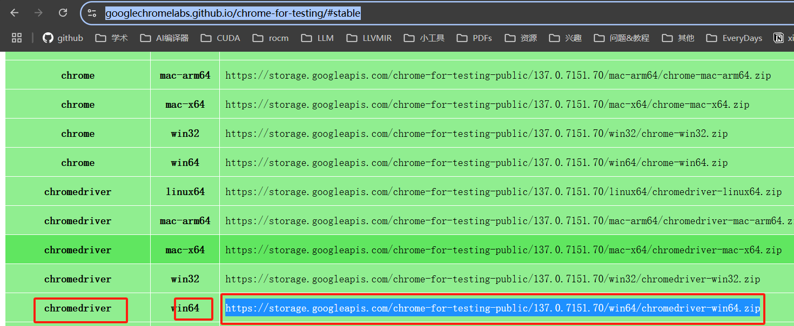
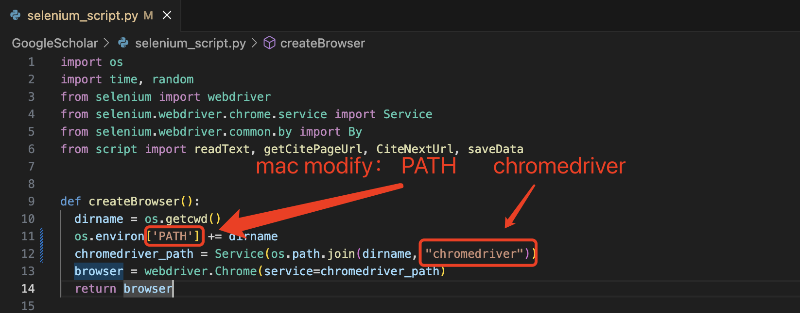

# GoogleScholar
生成被引用文章信息word模板，保存pdf下载链接
### 说明
1. 脚本可以保存我们需要的文章的word模板，以及保存pdf的下载链接，在文件夹 “files” 下
2. 先打开项目下的 src_paper.txt 文件，按一行一论文的格式填入需要搜索的文章
3. 再打开梯子，然后打开项目下的 script.py 脚本，确保脚本中 proxies 设置的端口 “7890” 和梯子的端口对应；
4. 然后打开谷歌学术，按F12打开控制台，点击 “网络” -> “文档”，再刷新页面，最后找到 cookie 中的 “__Secure-1PSID” 对应的 value

5. 将 script.py 中 cookies 的 __Secure-1PSID 的 value 修改成新的 value
6. 安装依赖，运行脚本
``` bash
pip install -r requirements.txt
python script.py
```
### 注意！
google有反爬机制（人机验证），如果打印出 “请重新获取cookies” 字样，则需要重复步骤 “3” -> “4”
如果仍然不能运行，那就自己下载吧。

## 添加新脚本
新添加了一个脚本 selenium_script.py ，实现上面相同功能，但是需要用到chrome浏览器
### 说明
1. 首先设置 src_paper.txt 文件
2. 打开chrome浏览器，查看浏览器版本版本，然后然后根据chrome版本号，打开网站下载 chromeDriver.exe 驱动，
[chromeDriver](https://googlechromelabs.github.io/chrome-for-testing/#stable)，
如果没有合适的版本就打开[chromeDriver](https://blog.csdn.net/zhoukeguai/article/details/113247342)


3. 下载完成后解压 zip ，将文件夹中的 chromeDriver.exe 驱动移动到项目目录下 (./GoogleScholar)
4. 安装依赖，运行脚本
``` bash
pip install -r requirements.txt
python selenium_script.py
```
### 注意！
1. 运行的时候尽量不要去切换页面，等到程序运行完成，后再去切换
2. mac系统修改脚本 selenium_script.py
3. 

